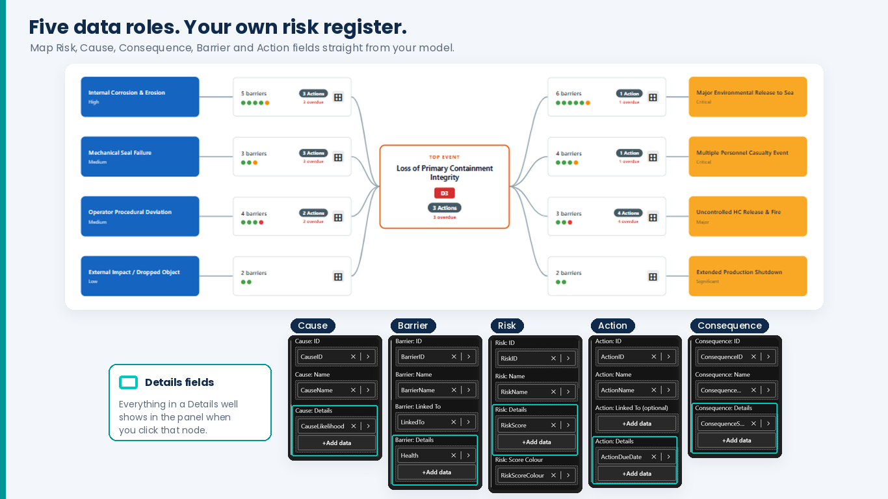

# Get started
{: .no_toc }

Three steps: add the visual, give it one flat table, and drag your columns into its field wells.
{: .fs-6 .fw-300 }

  
On this page

  {: .text-delta }
1. TOC
{:toc}

---

## 1. Add the visual

1. In Power BI Desktop or the Service, open the **Visualizations** pane → **…** → **Get more visuals**.
2. Search for **Bowtie Risk Visual** and select **Add**.
3. Drag the bowtie icon onto the report canvas and make it at least 900 × 500 px.
   Below 300 × 200 px it says *Resize to view bowtie* until it has room.

If you were given a `.pbiviz` file instead: **Visualizations** → **…** → **Import a visual from a file**.

## 2. Build one flat table

The visual reads **one flat table** where each row is a barrier (repeated once per action if it
has several). This guide calls it `BowtieCombined`.

{: .note }
> **Why one table?** If you drag columns from five separate tables into the visual, Power BI
> joins them for you and silently drops any barrier that has no action. A single flat table
> avoids that.

### You already have one flat table

Skip to [step 3](#3-bind-the-field-wells).

### You have five tables — Risk, Cause, Consequence, Barrier, Action

This is the usual case. Use the ready-made Power Query script:

1. Download [`BowtieVisual_CombineQuery.pq`](sampledata/BowtieVisual_CombineQuery.pq).
2. In Power BI Desktop: **Home** → **Transform data**.
3. **Home** → **New Source** → **Blank Query**.
4. Right-click the new query → **Advanced Editor** → delete what's there → paste the script.
5. Edit **only** the `CUSTOMISE` block at the top to match your table and column names.
6. **Done** → rename the query `BowtieCombined` → **Close & Apply**.

What you change in the `CUSTOMISE` block, and nowhere else:

| Setting | Meaning | Default |
|:--------|:--------|:--------|
| `T_Risk` … `T_Action` | The names of your five queries | `Risk`, `Causes`, `Consequences`, `Barriers`, `Actions` |
| `K_RiskID` | The risk key (must exist in Risk, Barrier, Cause and Consequence) | `RiskID` |
| `K_CauseID`, `K_ConsequenceID`, `K_BarrierID`, `K_ActionID` | Primary keys | as named |
| `K_BarrierLinkedTo` | Column on Barrier holding the CauseID or ConsequenceID it protects | `LinkedTo` |
| `K_ActionLinkedTo` | Column on Action holding the BarrierID, or the RiskID for risk-level actions | `LinkedTo` |

The query starts from your Barrier table and joins the rest onto it: barriers with no actions still
appear, and actions linked directly to a risk get their own rows. Causes and consequences come in
through their barriers, so one with no barrier yet won't appear until a barrier is linked to it.

{: .tip }
To see the expected shape first, open the [sample risk register](sampledata/BowtieVisual_SampleData_MultiRisk.xlsx).
It has the five source tables, named as the script's defaults expect, plus the finished
`BowtieCombined` table and a `RiskMatrix` sheet for [score colours](your-data#risk-score-colours).

## 3. Bind the field wells

Drag columns from `BowtieCombined` into the wells. The names below assume the script's defaults.

| Field well | Column | Required? |
|:-----------|:-------|:---------|
| Risk: ID | `RiskID` | Yes |
| Risk: Name | `RiskName` | Yes |
| Risk: Details | `RiskScore`, `RiskOwner`, … | Any risk fields you want on the card and in the panel |
| Risk: Score Colour | `RiskScoreColour` | Optional — see [score colours](your-data#risk-score-colours) |
| Cause: ID / Name | `CauseID`, `CauseName` | Yes |
| Cause: Details | `CauseLikelihood`, … | Optional |
| Consequence: ID / Name | `ConsequenceID`, `ConsequenceName` | Yes |
| Consequence: Details | `ConsequenceSeverity`, … | Optional |
| Barrier: ID / Name | `BarrierID`, `BarrierName` | Yes |
| Barrier: Linked To | `LinkedTo` | Yes |
| Barrier: Details | `Health`, `Effectiveness`, `Owner`, … | `Health` drives the colour strip |
| Action: ID / Name | `ActionID`, `ActionName` | Optional |
| Action: Linked To | `ActionLinkedTo` | Optional — see [how actions attach](your-data#how-actions-attach-to-barriers) |
| Action: Details | `ActionStatus`, `ActionDueDate`, `ActionAssignee`, … | Status and due date drive the overdue counts |

The bowtie draws as soon as the required wells are filled. Next: [Using the visual](using-the-visual).
