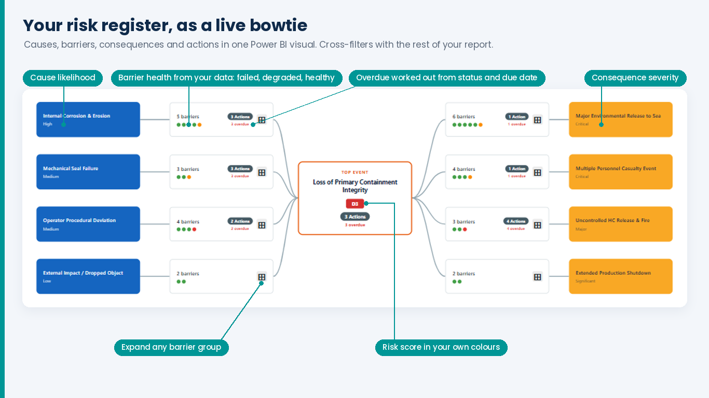

# Bowtie Risk Visual for Power BI
{: .fs-9 }

Draw bow-tie risk diagrams straight from the risk register you already have in Power BI.
No separate tool, no re-keying, no drawing by hand.
{: .fs-6 .fw-300 }

[Get it on AppSource](https://marketplace.microsoft.com/en-us/product/power-bi-visuals/prana-it-solutions.bowtie-risk-visual?tab=Overview){: .btn .btn-primary .fs-5 .mb-4 .mb-md-0 .mr-2 }
[Set up in 5 minutes](get-started){: .btn .fs-5 .mb-4 .mb-md-0 .mr-2 }
[Downloads](downloads){: .btn .fs-5 .mb-4 .mb-md-0 }

---

Causes on the left flow through prevention barriers to the top event, then through mitigation
barriers to consequences on the right. Barrier groups collapse to a summary card — count, health
dots, open and overdue actions — and expand to the individual barriers on a click.

## Two views, one dataset

| View | For | What's at the centre |
|:-----|:----|:---------------------|
| **Risk Bowtie** | Risk owners | One risk, with everything that leads to it and everything it leads to |
| **Barrier View** (Premium) | Barrier owners | One barrier, with every risk, cause and consequence it protects across the portfolio |

Both views read the same table, so you build your data once.

## Where to start

| I want to… | Go to |
|:-----------|:------|
| Try it on sample data | [Downloads](downloads) — sample report and sample risk register |
| Connect my own risk register | [Get started](get-started) |
| Understand what I'm looking at | [Using the visual](using-the-visual) |
| Know what's free and what's Premium | [Free and Premium](free-and-premium) |
| Fix something that looks wrong | [Support](support) |

## New in 1.3.1

- **Licensing** — Premium features are unlocked by a licence from Microsoft AppSource, with a one-month free trial. See [Free and Premium](free-and-premium).
- **Zoom, pan and the Expand All / Collapse All toolbar** in every Premium layout, not just the Auto layouts.
- **Your colours and fonts** from the Format pane now apply to the Grouped and Vertical layouts too.
- **Dates and numbers** in the detail panel follow the format set on each field in your model.
- **Steadier layouts** — both sides of the bowtie centre on the top event, rows keep their order when a group expands, and a large bowtie shrinks to fit the visual.
- **A tidier Format pane** that only shows the settings that apply to the chosen layout.
