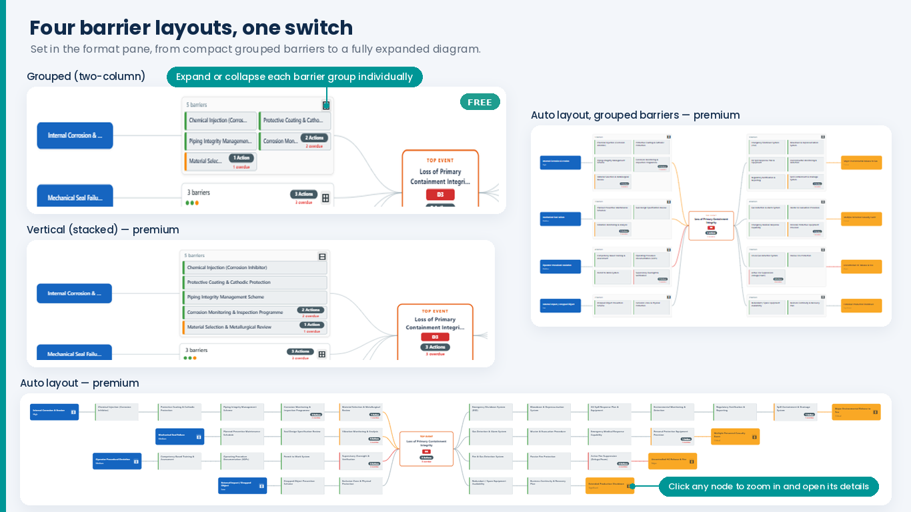
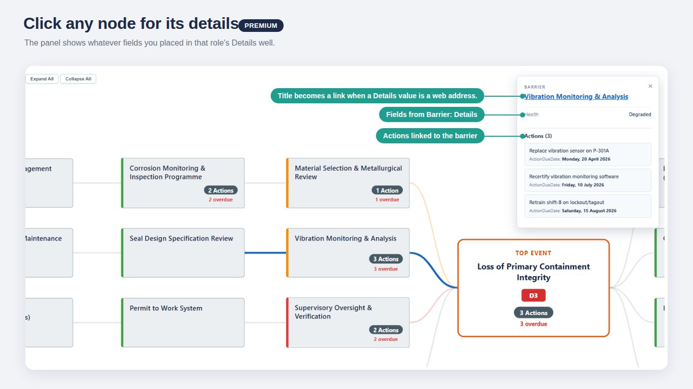
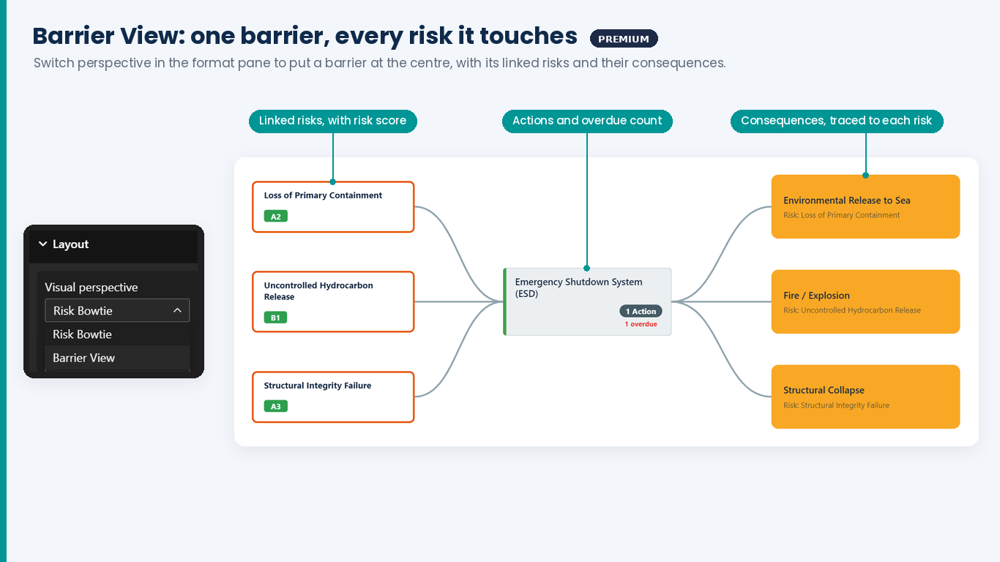

# Using the visual
{: .no_toc }

  
On this page

  {: .text-delta }
1. TOC
{:toc}

---

## Reading the bowtie

- **Blue cards, far left** — causes. The subtitle shows likelihood, if bound.
- **White cards next to them** — prevention barrier groups. Collapsed, each shows "N barriers", a
  row of health dots (green, amber, red), an action pill with any overdue count, and ⊞.
- **Orange-bordered card, centre** — the top event, with its risk-score badge and risk-level actions.
- **Group cards on the right** — mitigation barrier groups, the same as on the left.
- **Yellow cards, far right** — consequences. The subtitle shows severity, if bound.
- **Connectors** fan out from the top event. In the Auto layouts they turn red or amber after a
  failed or degraded barrier.

Hover any node for a tooltip with its name, health, action and overdue counts, effectiveness and
owner, where bound.

## The four layouts

Choose one in **Format** → **Layout** → **Barrier layout**:

| Layout | Expanded barriers appear as | |
|:-------|:----------------------------|:--|
| **Grouped** | a box, two columns | Free |
| **Vertical** | a box, one column | Premium |
| **Auto layout** | a chain along each path, positioned automatically | Premium |
| **Auto layout, grouped barriers** | a box, two columns, positioned automatically | Premium |

Every layout opens with collapsed barrier groups, unless **Start expanded** is on. When the bowtie
is larger than the visual, Grouped and Vertical scale it down so all of it stays visible.

## Expanding and collapsing

| To… | Do this |
|:----|:--------|
| Expand one group | Click ⊞ on its "N barriers" card |
| Collapse it again | Click ⊟ on the expanded box — or, in **Auto layout**, on the cause or consequence card (the chain has no box) |
| Expand or collapse everything | **Expand All** / **Collapse All** in the toolbar (Premium; hide it with *Show expand/collapse toolbar*) |
| Start with everything expanded | **Format** → **Layout** → **Start expanded** |

## The detail panel
{: .d-inline-block }

Premium
{: .label .label-premium }

Click any cause, consequence, barrier or the top event. A panel opens on the right with:

- every field in that node's **Details** well;
- for a barrier, the risk it belongs to and each linked action;
- for the top event, its risk-level actions.

Dates and numbers appear in the format set on the field in your model (for example `yyyy-mm-dd`, a
long date, or a percentage), in the viewer's language. A date field with no format uses the short
date for the viewer's locale.

**Links to your risk system.** If a Details value is a web address (starting `https://` or
`http://`), the panel title becomes a link to it, and the address itself isn't listed. Use this to
jump from a barrier straight to its record in your risk-management platform.

Click the same node again, click empty canvas, or press **×** to close the panel.

## Zoom and pan
{: .d-inline-block }

Premium
{: .label .label-premium }

In every Premium layout:

- **Scroll** to pan, **Ctrl + scroll** (or pinch) to zoom, **drag** to pan.
- Use the **+ / – / ⤢** buttons at the bottom left; ⤢ fits the whole bowtie back into view.
  Hide them with *Show zoom controls*.

In the Auto layouts and Barrier View, clicking a node also zooms to it and highlights its path,
and clicking empty canvas fits everything back. In Grouped and Vertical the view stays where you
put it; expanding or collapsing a group fits the bowtie again.

## Cross-filtering
{: .d-inline-block }

Premium
{: .label .label-premium }

Clicking a node selects the rows behind it, so every other visual on the page filters to them.
Put a table of actions next to the bowtie, click a barrier, and the table shows just that
barrier's actions.

## Barrier View
{: .d-inline-block }

Premium
{: .label .label-premium }

Set **Format** → **Layout** → **Visual perspective** to **Barrier View**. With no barrier chosen you
get a summary: every barrier, each showing how many risks it spans.

| To… | Do this |
|:----|:--------|
| Centre a barrier | Click it in the summary, or filter to it with a slicer or drill-through |
| Go back to the summary | **← All Barriers** |

Cause and consequence cards are labelled **Risk: <name>**, so a barrier shared by several risks
shows which risk each side comes from. Barrier View always reads across every risk in the data.

## Drill-through to your own pages
{: .d-inline-block }

Premium
{: .label .label-premium }

Right-click any node to get Power BI's drill-through menu. To set up a barrier page:

1. Add a report page. In its **Format** pane → **Page information** → **Drill through**, add
   `BarrierID` as the drill-through field.
2. Add a Bowtie visual with **Visual perspective** = **Barrier View**, bound to the same wells.
3. Add anything else that helps a barrier owner — an actions table, KPI cards.
4. On the main page, right-click a barrier → **Drill through** → your page. It opens filtered to
   that barrier, and Barrier View centres it.

A **risk page** works the same way, with `RiskID` as the drill-through field.

{: .note }
Power BI offers drill-through on every column in the selected rows, so right-clicking a risk also
lists the barrier page. Name your pages clearly.
